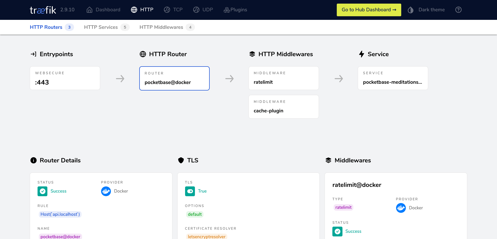

I made a few bucks on a freelance project recently. On these platform, you rarely get your money as soon as you complete the gig. So, awaiting my payoff, I was wondering what am I going to buy. As, I said, it wasn't a lot, so I cannot afford something very “useful”. And, it hit me. I'm going to work that hard, and spent all the money I made, and work that hard again… You see where I'm going. As I was thinking about investing, I told myself, why not building a SaaS. SaaS stands for Software as a Service, it's a kind of subscription you pay to use a software, it's opposed to lifetime licenses, where, when you pay, the software is yours for life.

_With freelancing, I'll always have to put a lot amount of work to earn the relatively same amount of money. Otherwise, with a SaaS, I'll put a lot of effort in front but can relax later._

First question, what am I going to build? I thought about an old Flutter app I coded a long time ago. It's a quote management app called **Meditations**¹. I really wanted to add a bunch of exciting features like `!@#$%^&`, but never got time (and motivation) to do so. Now, money will be the motivation 😅. A project? Got it. What's next?

Simply put, the first feature I'm going to ship is the quote syncing. To do so, I need a backend and a database to store the user's quotes. Am I going to code a backend? No! I'm going to use PocketBase². PocketBase is an open source backend, it let you create a data model in a UI and generate API endpoints for you. It uses SQLite to persist data (I know, when you think of a database, SQLite isn't the first option you might think of, but I don't except my app get a billion concurrent requests anytime soon).

| Pros                                          | Cons                           |
| --------------------------------------------- | ------------------------------ |
| API, auth and a nice dashboard out of the box | Still under active development |
| Lightweight                                   | Doesn't scale horizontally     |

_Pros and cons of using PocketBase._

After not having to code a backend, I decided to add an API management solution called Kong\[³\]. I wanted the following features: **rate limiting and caching**. It was mandatory for me. If my app is going into the wild, I want it to be prepared for that. I designed the following architecture:

_Desired backend architecture._

The backend will be connected to Kong and the latter will be “reverse proxied” by Caddy (precisely caddy-gen⁴, a great Docker image that automate caddy for Docker containers). Then, I started playing with the Kong Docker image. First disappointment, it needs Postgres or Cassandra (a column-oriented database) to run. Quickly got over it after digging into the docs and discovered the db-less mode. After spending many hours tweaking my `docker-compose.yml`, I found successively that the Kong Manager (their GUI admin dashboard) and rate limiting plugin wasn't available for the open sourced version. Just at this time, I wondered why I'm not using Traefik⁵ (Traefik is reverse proxy with automatic HTTPS like Caddy). Back in the days, I struggled to configure Traefik, this is why I switched over Caddy and was using it everywhere. But, I got Traefik to work not so long ago, therefor I checked it out, and it had all the Kong features I wanted, plus a very nice dashboard 😉.

_Traefik dashboard._

Finally, I got this architecture⁶:

_Actual backend architecture._

Once my setup was working on `localhost`, I had to make it available through the Internet. I spin up my infrastructure with Terraform⁷ and Ansible⁸ on GCP⁹. Spend like two days on this, writing IaC¹⁰. Now that I have my backend up and running, it's time to dusted off the mobile app. See you on the next one 😉

_At least I haven't failed 😅_

**Notes:**

1\. [Meditations app repository](https://github.com/marcaureln/meditations/)

2\. [PocketBase website](https://pocketbase.io/)

3\. [Kong Gateway documentation](https://docs.konghq.com/gateway/latest/)

4\. [caddy-gen repository](https://github.com/wemake-services/caddy-gen/)

5\. [Traefik website](https://traefik.io/)

6\. [Meditations backend repository](https://github.com/marcaureln/meditations-api/)

7\. [Terraform](https://www.terraform.io/) lets you describe and deploy (also called provisioning) cloud infrastructure with code.

8\. [Ansible](https://www.ansible.com/) automate server configuration (system updates, install software, and more) with files called “playbooks”.

9\. [Google Cloud Platform (GCP)](https://cloud.google.com/) is Google cloud computing offering. It's Google equivalent of AWS and Azure.

10\. Infrastructure as Code (IaC) consists of managing and deploying infrastructure (aka servers, load balancers, etc.) through code instead of doing it manually through provider UI.
